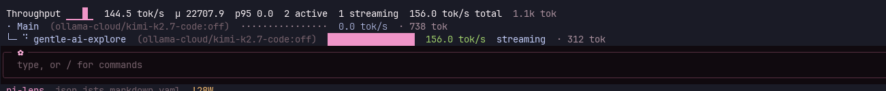

# tps-gentle-pi

A live tokens-per-second (TPS) meter for the [Pi coding agent](https://pi.dev). It
draws a compact two-part panel above the editor: a **header line** with the turn
sparkline, last rate, mean (`μ`), P² p95, participant counts, and panel-wide rate
and token totals, plus one **row per participant** — the main agent and each
[gentle-pi](https://www.npmjs.com/package/gentle-pi) subagent whose correlation
evidence is deterministic. It is a zero-build TypeScript package: Node 24 executes
the sources directly, and nothing is compiled.

> **Answer:** the meter works on **vanilla Pi** (no gentle-pi) with zero
> subagent rows, and degrades silently — a channel or aggregation failure never
> disables the main meter.

## Quick path

1. Install the package from the Pi package gallery:

   ```sh
   pi install npm:tps-gentle-pi
   ```

2. Start a TUI session and stream a response. The panel appears above the editor.
3. Confirm the header aggregates (sparkline, `μ`, `p95`, totals) and the main row
   gauge and `tok/s` update while output streams.

## What it looks like

The panel sits above the editor while a response streams. It has two parts: a
**header line** with the session-wide aggregates, then one **row per participant**
(the main agent plus every live subagent).

```text
Throughput ▂▃▄▅▄▅▆▆▇▇██  58.0 tok/s  μ 38.2  p95 51.0  3 active  1 streaming  84.6 tok/s total  14.6k tok
· Main  (claude-3-7-sonnet:high)  ████████████████  42.5 tok/s  · 12.3k tok
├─ ◇ explore auth  scout  (claude-3-5-haiku)  █████████▏······  24.1 tok/s  tool: read  · 1.4k tok
└─ ⠴ write tests  worker  (claude-3-5-haiku:low)  ██████▊·········  18.0 tok/s  streaming  · 820 tok
```

| Part | Fields, left to right. Trailing fields drop on narrow terminals. |
| --- | --- |
| Header | `Throughput` + 12-turn sparkline, last `tok/s`, `μ`, `p95`, `N active`, `N streaming`, panel `tok/s total`, total `tok` |
| Main row | phase icon, `Main` (or `Main [tool: x]`), `model:thinking` on wide, relative gauge, `tok/s`, `· N tok` |
| Subagent row | tree glyph + phase icon, correlated label or honest `subagent · <pid>`, dimmed badge, `model:thinking` on wide, relative gauge, `tok/s`, phase/tool state, `· N tok` |

The gauge is **relative**: every row fills against the fastest live participant in
the panel, so a quiet panel still shows its shape. The header aggregates derive
only from the tracker and the live rows — nothing is fabricated.

> Screenshots below are from the previous release and will be regenerated.


*Main meter: gauge, live `tok/s`, 12-turn sparkline, `μ`, and `p95`.*



*Main meter with one active gentle-pi subagent row while the worker streams.*

## How it works

| Area | Decision |
| --- | --- |
| Main meter | Live TPS from output deltas since the first delta, preferring provider-reported usage and falling back to a `ceil(chars / 4)` estimate. Authoritative usage is recorded at message end and pushed into the sparkline, mean, and P² p95. |
| Roles | `session_start` selects `parent-tui` (TUI + no child marker), `gentle-worker` (child marker + inherited channel), or `headless-noop`. |
| Subagent channel | The parent creates one private, unpredictable session directory; each worker publishes a throttled, atomic, schema-validated snapshot. The parent aggregates only live snapshots. |
| Identity | A correlated badge is shown only when exactly one worker and one active task match. Otherwise the row uses an honest fallback (`subagent` / `subagent · <pid>`) and never guesses. |

## Installation and child visibility

Install as a **package** (`pi install npm:tps-gentle-pi`) so gentle-pi can load the
extension inside every child worker. Gentle Agents launches subagents as isolated
`pi --mode rpc` child processes, so the only ways a child gets the extension are
package discovery or an explicit propagated load.

A one-off **`pi -e`** load in the parent is *not* propagated to children. In that
case the main panel keeps working, but no subagent rows appear — the extension
never fabricates rows for workers that did not publish a snapshot.

## Vanilla Pi and fallback

On vanilla Pi (no gentle-pi installed, no Gentle Agents tools observed), the
extension consumes only the public `ExtensionAPI`/`ExtensionContext` surface
(`pi.on`, `ctx.mode`, `ctx.hasUI`, `ctx.ui`) and never imports gentle-pi at
runtime. The main-agent live TPS, sparkline, mean, and p95 work fully, and zero
subagent rows are rendered.

Every optional subagent path degrades safely: directory creation, publication,
reading, validation, aggregation, or cleanup failures leave subagent rows absent
while the main panel continues updating. No exception escapes to the Pi session.

## Temporary files, privacy, and lifecycle

- The parent creates **one** private session directory under `os.tmpdir()`, named
  `pi-tps-<pid>-<ts>-<random>` and owned by the `.owner` marker
  (`{ pid, created, v: 1 }`).
- On Linux/macOS the directory is mode `0700` and snapshots are mode `0600`; on
  Windows the user's own temp directory and inherited ACLs apply with no POSIX
  modes.
- Snapshot packets contain **only** metric/state fields (identity, model, phase,
  active tool, TPS, token counters, PID, timestamps) — never prompt, task, or
  generated text.
- Children unlink their own snapshot on normal shutdown. The parent removes only
  its own session directory on `session_shutdown`; a startup scavenger removes only
  verified package-owned stale directories (`.owner` + dead PID + older than one
  hour), preserving every foreign or markerless directory.
- All metrics are session-scoped and in-memory. There is **no telemetry**, no
  analytics, no network service, and no durable storage; removing the package and
  restarting leaves no residual state.

## Supported platforms

Linux, macOS, and Windows. The channel and tests use only cross-platform Node
APIs (`fs`, `os`, `path`, `process`, timers); no shell commands run on any path.
Run the suite with the Node built-in runner:

```sh
npm test
```

## Package metadata

- Name: `tps-gentle-pi`
- Node requirement: `>=24.0.0` (`engines.node`). Node 24 executes the TypeScript
  sources directly via type stripping, so there is no build step.
- Pi manifest: `pi.extensions = ["./extensions"]` (Pi discovers the extension here)
- Discovery keywords: `pi-package`, `pi-extension`, `throughput`,
  `tokens-per-second`, `tps`, `meter`
- Optional peer dependency: `@earendil-works/pi-coding-agent` with the `"*"` range,
  declared optional via `peerDependenciesMeta`. Pi bundles its core packages, so
  extensions list them as `"*"` peers and never bundle them.
- Release channel: `publishConfig.access` is `public`; releases go through the
  GitHub Actions `publish.yml` workflow with npm provenance.

## Repository

- Source: <https://github.com/glacayo/tps-gentle-pi>
- Issues: <https://github.com/glacayo/tps-gentle-pi/issues>

## Troubleshooting

| Symptom | Cause and fix |
| --- | --- |
| Main meter works, no subagent rows | Install as a package (`pi install npm:tps-gentle-pi`) instead of a `pi -e` load, so children inherit the extension. |
| Panel never appears | Ensure the session is a TUI session (`ctx.mode === "tui"`); headless/RPC sessions are silent by design. |
| Row labels show `subagent · <pid>` | Correlation evidence is ambiguous; this is the honest fallback, not a bug. Run only one delegated task to get a badge. |
| Lines look truncated on a narrow terminal | The panel clamps adaptively (wide ≥ 120, standard 80–119, narrow 60). Fields hide deterministically rather than overflowing. |
| `npm test` fails with a module-not-found | Use Node 24 (`node --test` runs `.ts` natively via type stripping); no build step is required. |
